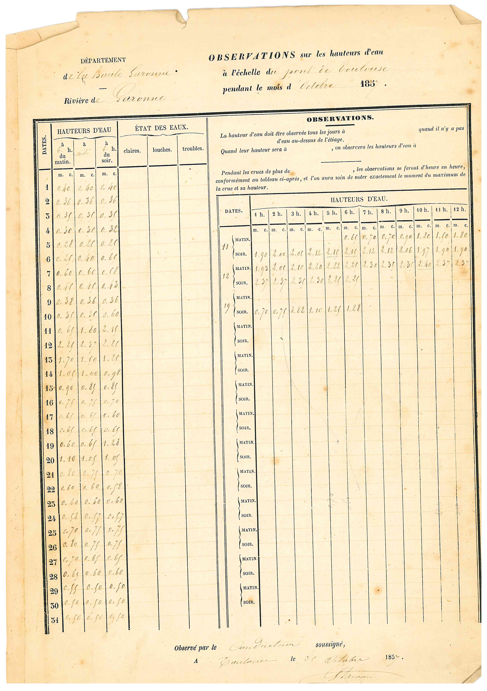
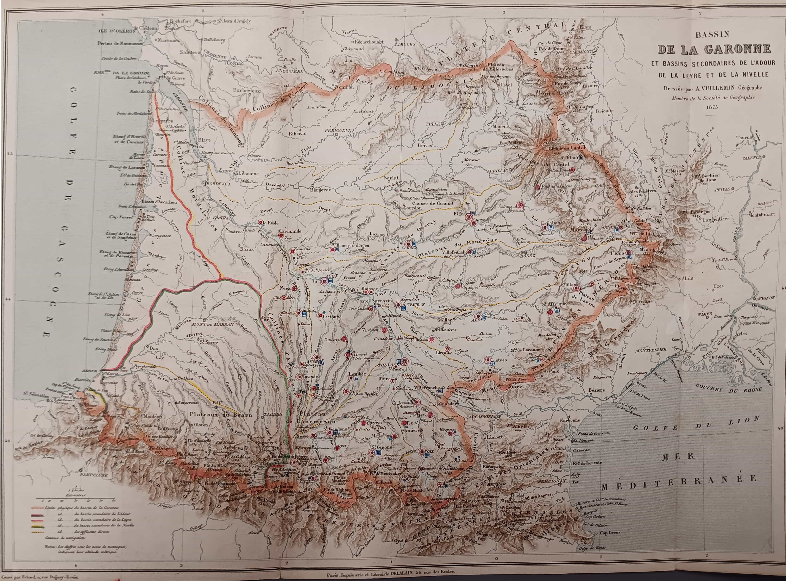

# hackaviz-2025 : Que d’eau, que d’eau !
<aside>
💡
POUR LE NEOPHYTE : il y a beaucoup de jeux de données proposées, mais rien n'oblige à tout utiliser. Vous pouvez en choisir un seul ou même un sous-ensemble des données qu'il contient pour raconter une belle histoire.

Durant la durée de l'épreuve, le salon Discord #hackaviz2025 est ouvert pour poser des questions et échanger: https://discord.gg/wd4SKKDARC

</aside>

---


-----
Toulouse Dataviz a rassemblé cette année un ensemble de jeux de données qui rend hommage aux 150 ans de la crue du 23 juin 1875 qui a dévasté de nombreuses communes dans les trois départements : Haute-Garonne, Tarn-et-Garonne et Lot-et-Garonne. 200 morts et 25 000 sans logement.

A Toulouse, ont été lourdement affectés, surtout la rive gauche de la Garonne (Saint-Cyprien et Croix de Pierre) mais aussi la rive droite (Saint-Michel et Amidonniers). Cet événement est à l’origine des constructions de prévention déployés depuis : digues, portes sur les berges, nouvelles règles de construction, … Et bien sûr, la mise en place de politiques publiques de surveillance, d’alerte et de mise en sécurité si nécessaire.

https://fr.wikipedia.org/wiki/Crue_de_la_Garonne_en_1875

https://jeparticipe.metropole.toulouse.fr/processes/les150ans-crues-garonne

Le sujet est complexe et l’événement est ancien, mais heureusement les générations précédentes ont eu la sagesse de mettre en place une organisation humaine permettant le relevé systématique  des niveaux des cours d’eau et de la pluviométrie.



# Les données

Les données sont disponibles sous différents formats :

- xlsx ou csv
- json ou geojson
- parquet

Elles peuvent être directement lues sur le repository github en préfixant le nom du fichier par :

```
https://raw.githubusercontent.com/Toulouse-Dataviz/hackaviz2025/refs/heads/main/data/<nom de fichier.suffixe>
```

## 1- Les stations et sites

C’est sur ces points géographiques que sont mesurées l’hydrométrie et la pluviométrie. Elles couvrent ce que l’on appelle le **bassin versant**  de la Garonne : les principaux cours d’eau qui contribuent au débit de la Garonne (Ariège, Tarn, Lot, …). 



On dispose de l’historique de 132 stations, leurs attributs sont :

**station**

| Attribut | Description | Exemple |
| --- | --- | --- |
| code_site | Le code du site de la station | chaîne |
| libelle_site | Le libellé du site de la station | Le Maudan à Fos et à Melles |
| altitude | L'altitude du site en m | 711 | 
| libelle_departement | Le nom du département | HAUTE-GARONNE |
| longitude | Longitude | 0,691927455 |
| latitude | Latitude | 42,91562157 | 
| code_station | Le code de la station | O004402001 |
| libelle_station | Le libellé de la station | La Garonne à Fos|
| libelle_commune | Libellé de la commune | BAGNERES-DE-LUCHON |
| libelle_cours_eau | Libellé du cours d’eau (si existant) | La Garonne |
| date_ouverture_station | Date d’ouverture de la station | année-mois-jour |
| date_fermeture_station | Date de fermeture de la station (si existante) | année-mois-jour |
| en_service | En service à ce jour | Booléen |
| cote_zero_echelle | L'altitude du point de référence des mesures de hauteur | réel |

## 2- Hydrométrie
### Les 7 crues de 1857 à 2022 en terme de hauteur d’eau

**hauteur_eau_7_crues**

Le fichier contient un historique temporel autour des 7 crues historiques depuis 1905.
(Attention le nombre de stations actives varie d’une crue à l’autre)


| Attribut | Description | Exemple |
| --- | --- | --- |
| code_site | Code site | chaîne |
| code_station | Code de la station | chaîne |
| date | Date d’observation | année-mois-jour |
| longitude | Longitude | réel |
| latitude | Latitude | réel |
| hauteur | Hauteur d'eau en mm | 3450 |
| code_crue | Le label de la crue   | 1905 |


### Les 5 crues de 1905 à 2022 en terme de débit d’eau
1905, 1952, 1977, 2000, 2022

**debit_5_crues**

Le fichier contient un historique autour des 5 crues historiques depuis 1905.
(Attention le nombre de stations actives varie d’une crue à l’autre)

| Attribut | Description | Exemple |
| --- | --- | --- |
| code_site | Code site | chaîne |
| code_station | Code de la station | O125251001 |
| date_observation | Jour de la mesure | 17/01/1905 |
| longitude | Longitude | 1,60885338 |
| latitude | Latitude | 42,96626251 |
| debit_moyen_journalier | Débit moyen journalier en m3/s | 22323 |
| code_crue | Le label de la crue   | 1905 |


### Une série longue de 160 ans pour Toulouse (mesuré au pont Neuf)

Toutes les heures, 30 minutes, 15 minutes et 5 minutes au fur et à mesure de l’avancée technologique des moyens de mesure.

**hauteur_eau_serie_longue_toulouse** uniquement au format parquet
**hauteur_eau_synthese_toulouse** la hauteur maximale de la journée en xlsx

| Attribut | Description | Exemple |
| --- | --- | --- |
| date | Date d’observation | année-mois-jour-heure-minutes |
| hauteur | Hauteur d'eau en m | réel |

Ce fichier assez volumineux n'est disponible qu'au format parquet.

 
## 3- Pluviométrie

Sur certaines stations se trouve un poste météo qui renseigne depuis 1809 notamment la pluviométrie. à ce point uniquement en Haute Garonne et Ariège. Idéalement un seul fichier qui reprend les plage de temps des 6 crues. 

**pluviometrie_7_crues**


| Attribut | Description | Exemple |
| --- | --- | --- |
| code_site | Code site | chaîne |
| code_station | Code de la station | chaîne |
| date| Date d’observation  | année-mois-jour |
| longitude | Longitude | réel |
| latitude | Latitude | réel |
| pluvio | Hauteur de pluie en mm | réel |
|  |  |  |


## 4- Elévations - Modèle du terrain

Pour les plus audacieux nous avons rassemblé l’élévation d’une bande de 100m entourant le cours de chacun des cours d’eau du bassin. Autrement dit l’altitude sur 36 000?? points correspondant à une grille partielle de points espacés de 20m.

En 2 formats seulement : geoparquet et tif (raster)

**altitude_bassin_garonne**

**altitude_toulouse_st_cyprien**

Ce qu'il faut retenir c'est que l'addition de la hauteur d’eau et de l'altitude du point de référence de la station fournit une grandeur **comparable** aux élévations de terrain.
 

# Références

Liste de principales références ayant permis de constituer les jeux de données mis à disposition

| [https://hydro.eaufrance.fr](https://hydro.eaufrance.fr/) |  |
| --- | --- |
| [https://hubeau.eaufrance.fr/](https://hubeau.eaufrance.fr/) |  |
| ign |  |
| data gouv  |  |

*Depuis le 24 novembre 2021, deux types d'observations "élaborées" (débits moyens journaliers et débits moyens mensuels) sont dorénavant disponibles sur tout l'historique (depuis 1900 pour certaines stations) pour plus de 4200 stations. Les données sont mises à jour quotidiennement.*
